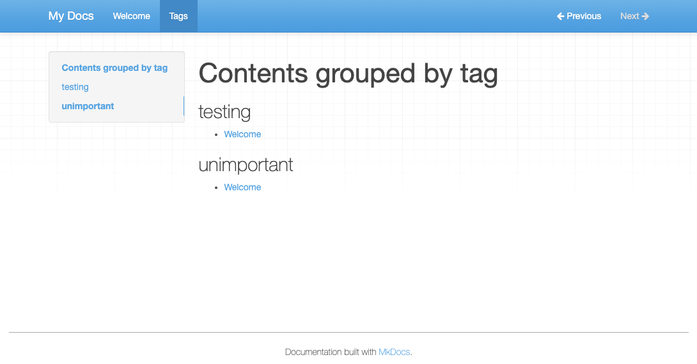

# Tags

Support for tags in the yaml-metadata in the header of markdown files.

Extracts this metadata and creates a "Tags" page which lists all tags and all pages for each tag.

## Quick Demo

Install this plugin (it will also install mkdocs if required)

```shell
$ pip install git+https://github.com/jldiaz/mkdocs-plugin-tags.git
```

> **Note**. Since this package is in alpha stage, it is not yet available from pypi, so the only way to install it is via git.

> **Additional note**. If you are using `pipenv` you must use the following syntax:
> ```shell
> $ pipenv install git+https://github.com/jldiaz/mkdocs-plugin-tags.git#egg=tags-macros-plugin
> ```

Create a new documentation folder:

```shell
$ mkdocs new demo
```

Edit the `.md` files to add initial metadata. Currently, the metadata has to be enclosed in `---` lines, and must include a `title:` property (otherwise the page will appear as "untitled" in the tags page). So, for example:

```
$ cd demo
$ cd docs
$ cat > index.md
---
title: Welcome
tags:
 - testing
 - unimportant
---
# Welcome to MkDocs

For full documentation visit [mkdocs.org](https://mkdocs.org).

^D
```

Edit `mkdocs.yml` to include this plugin:

```
plugins:
  - tags:
```

Run the server:

```
$ mkdocs serve --livereload
```

Visit the URL `/tags` (it should appear in the nav panel). This is an auto-generated page which contains the tags as level 2 headers, and under each tag, a listing of the pages which declare that tag in the metadata section.



# How it works

On each build (even with `--livereload`), all the `.md` files composing the site are scanned, their "triple-dash-delimted" yaml header is extracted and parsed, and the list of tags is collected. 

After that, a new temporal file is created (by default in `aux/tags.md`, but this is customizable) which contains the generated tags page, in markdown format. This file is not in the documents folder to avoid retriggering a build, but it is added to the list of files to be converted to HTML by mkdocs.

# Customization

The layout of the tags page is a markdown file with jinja2 embedded contents. The package provides such a template by default, with the following content:

```markdown
---
title: Tags
---
# Contents grouped by tag



## <span class="tag">{{tag}}</span>

  * [{{page.title}}]({{page.filename}})



```

You can style the `h2.tag` element via CSS, if you want.

You can also provide your own markdown template, in case that you want a different layout or metadata. The `page` object contains all the metadata in a mkdocs page, and in addition a `.filename` attribute, which contains the file name of the source of the page (relative to the docs folder), which can be used to link to that page.

The full customizable options for the plugin are:

* `tags_folder`: Folder in which the auxiliar tags markdown file will be written (`aux` by default, relative to the folder in which `mkdocs` is invoked). It can be set to an absolute path, such as `/tmp/mysite/aux`. The required folders are created.
* `tags_template`: path to the file which contains the markdown-jinja template for the tags page. It is `None` by default, which means that the package-provided template is used. It can be an absolute path, or relative to the folder in which `mkdocs` is run.

For example, this can be put at `mkdocs.yaml`:

```
plugins:
    - search
    - tags:
        tags_folder: /tmp/mysite/aux
        tags_template: docs/theme/tags.md.template
```

# TODO

* Remove the requirement of having a `title:` metadata in the YAML header (take the title of the page from other place if absent)
* Allow for yaml metadata which is not "triple-dash" delimited.
* Better integration with themes (tested with Material, looks good)
* Make visible the tags in each page? Currently they are "invisible metadata". The author can provide a jinja2 custom "main" template which renders them from `page.meta.tags`, but perhaps it could be useful that the plugin rewrites the markdown of each page (on page load), to add this metadata as part of the "visible" markdown.
